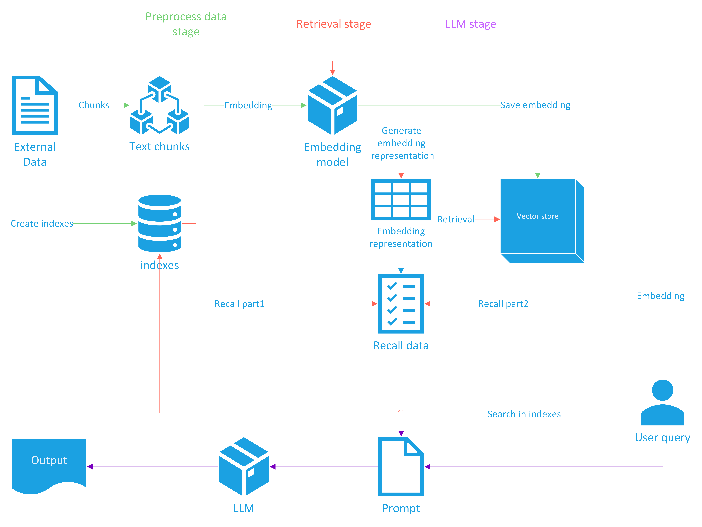
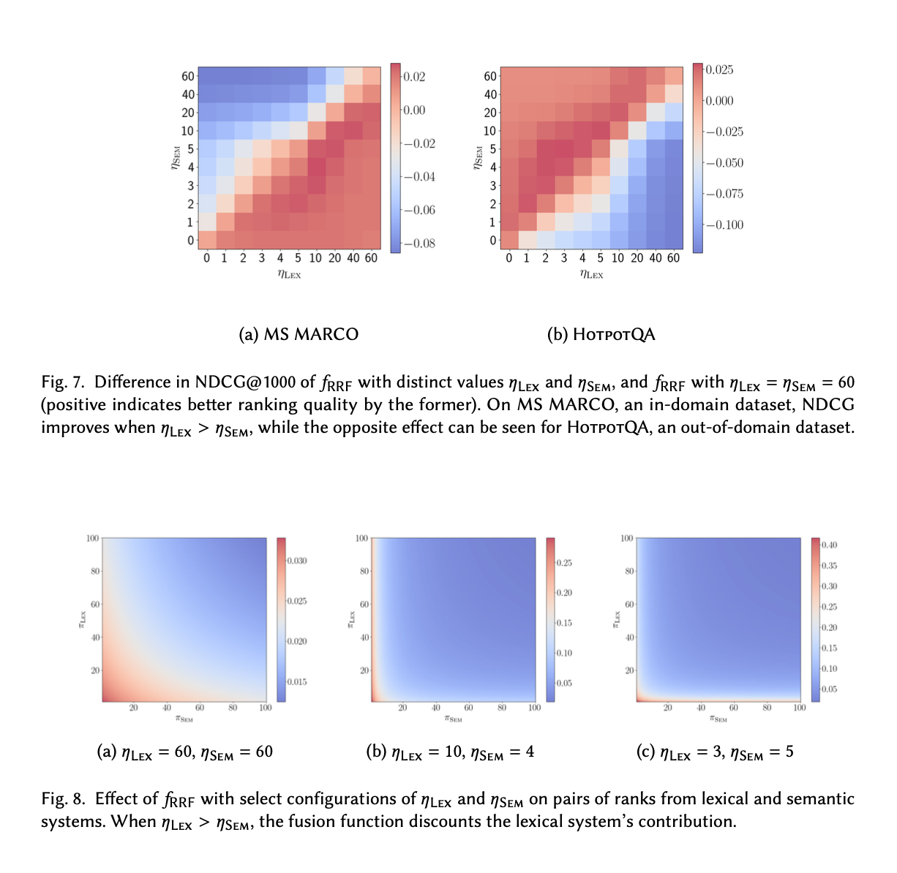
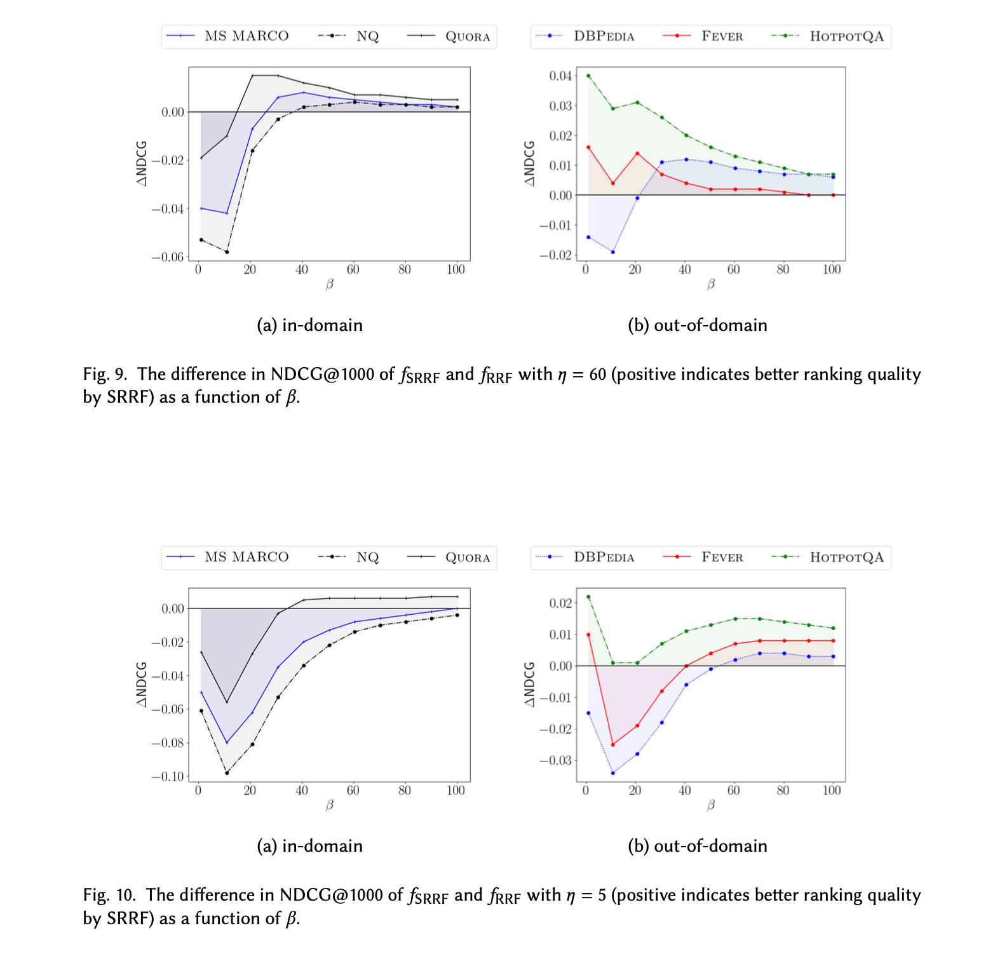
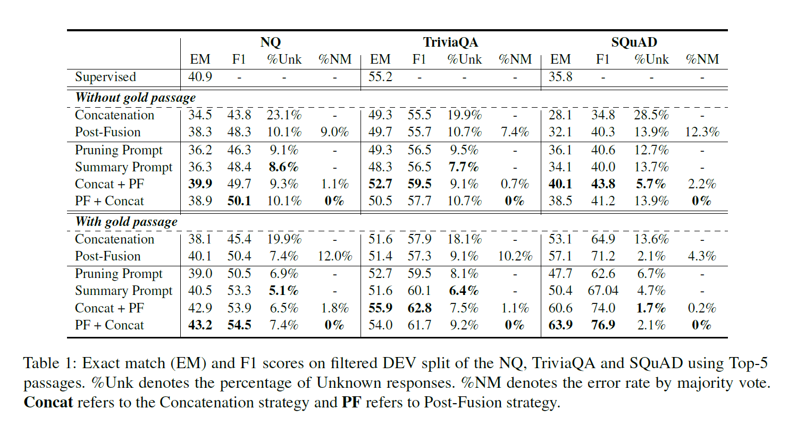
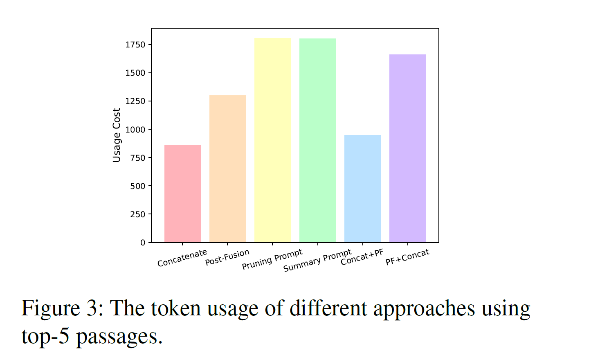

# RAG-Survey



为了便于理解整体逻辑，只画出了一些核心步骤，粗略分为3部分：

- Preprocess data stage: 这个阶段需要我们将外部数据进行处理，这里列举了两种方式：
    1. 构建索引，便于后续进行倒排检索；
    2. 构建vector store，这里常见的问题是数据的长度可能很长，需要根据一些规则和语义进行语句或者段落的切分，称之为chunks，然后将chunks编码为embedding，存储至vector store。
- Retrieval stage: 基于用户query进行检索，目的是在prompt引入召回的相关文档，减少大模型幻觉以及产生错误答案，基于上述构建的两种方式进行检索。
- LLM stage: 基于用户query和召回的相关文档构建prompt，送入LLM，产生最终的回答

<!-- more -->

## Preprocess data stage

### Text split

处理数据的第一步就是要做文本切分，大部分情况下，长文本数据都需要切分成以语义为单位的块，但是如何切分成语义为单位的块，现阶段没有一个较为完美的解决方案，Langchain中提供了一些文本切分的方案，其中常用的是Recursively split by character，MarkdownHeaderTextSplitter，HTMLHeaderTextSplitter。除此之外，正则表达式切分也是常用的方式。

- 依据语义进行切分，使用各种方式吧，总能切成满意的语义单位的chunks，召回的时候就是召回chunks
- 切分成chunks后，然后依据句子level进行切分，做成一个key-val映射的这么一个形式。

### Chunks增强

知识增强一般是指，根据上下文重新 Refine 原始的文本使得原始的文本信息更完整，自解释性更强。这个过程由于是离线的一次性处理，所以这里可以借助能力更强的商用 LLM 模型，生成的内容可能会更好。另外由于现在的 LLM 能支撑的上下文 context 长度很长，建议在生成的过程中，在 prompt 中去融入一些该场景的丰富背景信息。


通过知识增强，可以把文本文档也转化成 FAQ 的形式，使得对于一般的文档也能够同时进行 QQ 和 QD 召回。但这里需要注意的是，对于特别垂直的领域，能力很强的商业 LLM 也可能无法提取出比较合适的问题，一般观察到的现象是提取出的问题过于直接，或者提取出的问题无实际意义，这部分建议走一遍人工审核。

对于质量不高的 FAQ，特别是提问过于简略的，知识增强也能够优化其质量。另外经过优化后的知识，在 LLM 生成阶段，对于提升 LLM 对知识的理解也是有一定帮助的。总的来说，知识增强是简单有效的优化手段。

可以假设50个长度能够提取一个有效的问题，那么依据文本长度可以生成可变的问题数量，生成问题后，还可以对问题进行增强，生成更多样的提问。

### Embedding

| embedding name | tokenizer | 最大输入token数 | 输出维度 |
| --- | --- | --- | --- |
| text-embedding-ada-002 | cl100k_base | 8191 | 1536 |
| bge-large-zh | - | 512 | 1024 |

在我们的QA任务中，使用了上述2个embedding模型，由于bge只有512的长度，对于编码整个QA context是不现实的，在实验中，只编码了Question，对比效果，依旧是OpenAI embedding的效果要好，而编码QA context要比单独编码question的效果好。评估指标选择nDCG@3，覆盖率。

## Retrieval stage

对于召回阶段，使用text-embedding-ada-002模型以及ElasticSearch，分别对单检索和混合检索进行实验对比，分别对bm25，knn和RRF作对比，评估指标选取nDCG@3，RRF>bm25>knn，但是bm25和knn的差距不大。

### Hybrid search

#### [RRF](https://plg.uwaterloo.ca/~gvcormac/cormacksigir09-rrf.pdf)

$$
RRFScore(d \in D) = \sum_{r \in R} \frac{1}{k+r(d)}
$$

其中k为一个参数，默认设置为60，r(d)为当前排序的idx(从1开始)，RRF只考虑每次排序的位置，丢弃了排序中数据对应的分数。在实际的使用效果来看，RRF比单独的lexical search和单独的semantic search的效果要好。

```python
def reciprocal_rank_fusion(search_results_dict, k=60):
    fused_scores = {}
    print("Initial individual search result ranks:")
    for query, doc_scores in search_results_dict.items():
        print(f"For query '{query}': {doc_scores}")
        
    for query, doc_scores in search_results_dict.items():
        for rank, (doc, score) in enumerate(sorted(doc_scores.items(), key=lambda x: x[1], reverse=True)):
            if doc not in fused_scores:
                fused_scores[doc] = 0
            previous_score = fused_scores[doc]
            fused_scores[doc] += 1 / (rank + k)
            print(f"Updating score for {doc} from {previous_score} to {fused_scores[doc]} based on rank {rank} in query '{query}'")

    reranked_results = {doc: score for doc, score in sorted(fused_scores.items(), key=lambda x: x[1], reverse=True)}
    print("Final reranked results:", reranked_results)
    return reranked_results
```

#### [Analysis of fusion functions for hybrid retrieval](https://arxiv.org/pdf/2210.11934v2.pdf)

主要对convex combination(其实就是权重加和，要求权重和为1)和RRF做了实验分析，其中实验验证了RRF对于参数敏感，而在少量样本做监督微调后，convex combination的检索方式要优于RRF。

**Analysis of convex combination**

对于两个不同检索方式得到的召回数据，分数范围不一致，一个比较直接的想法就是对分数做归一化，然后把归一化后的数据做权重加和，得到最终分数。其中该部分内容对为什么混合检索有效以及归一化最优方式做了实验分析。

将正负样本的lexical search分数和semantic search分数计算并归一化，得到下图，观察可以看到正负样本在散点图是有相对清晰的簇形成的，虽然这里的任务是进行排序，但是从散点图，也可以观察到正负样本在lexical search和semantic search的分数是有一定的规律的。


在论文实验中最优的归一化方式为Theoretical min-max scaling，其中对于BM25的理想下界是0，对于余弦相似度的理想下界是-1

$$
\phi_{TMM}(f_o(q,d))=\frac{f_o(q,d)-\mathrm{inf}  f_o(q,\cdot)}{M_q-\mathrm{inf} f_o(q,\cdot)}
$$

**Analysis of RRF**

在实验中，以NDCG和Recall为指标，RRF比单独的lexical search和单独的semantic search的效果要好，但是没有convex combination的效果好，与我自己实际使用的效果一致。

RRF存在两个问题：

- RRF只是对召回的topk数据的顺序进行近似排序计算，并有真正的对数据顺序计算。(lexical和semantic召回的数据并不总是一样，只存在其中之一的数据，在另一路召回没有对应的分数)
- RRF只关注topk数据的位置，忽略了真实分数以及分布信息。

RRF的公式如下，其中$\eta$默认为60。

$$
f_{\mathrm{RRF} }(q,d)=\frac{1}{\eta + \pi _{\mathrm{LEX} }(q,d)} +\frac{1}{\eta + \pi _{\mathrm{SEM} }(q,d)}
$$

RRF用位置信息替换掉了分数信息，这样的设定是否合理以及$\eta$的大小是否影响RRF的效果，是否能在各个都适用，需要在各个数据集进行验证。假设$\eta \rightarrow \infty$，那么RRF的值会坍缩为一个点。假设$\eta=60$，我们在不同的数据集上画出lexical和semantic召回数据的正负样本，红色为正，黑色为负，可以看到正样本倾向于聚集在(1/61,1/61)，而负样本倾向于聚集在(0,0)，但是HotpotQA和FEVER数据集看到部分正样本也汇聚于(0,0)，这就表明当$\eta=60$的情况下，在不同数据集泛化能力是值得商榷的。


那么我们对不同的召回参数化$\eta$时，看看会发生什么？

$$
f_{\mathrm{RRF} }(q,d)=\frac{1}{\eta_{\mathrm{LEX}} + \pi _{\mathrm{LEX} }(q,d)} +\frac{1}{\eta_{\mathrm{SEM}} + \pi _{\mathrm{SEM} }(q,d)}
$$

从下图可以看到，当$\eta_{\mathrm{LEX}}$和$\eta_{\mathrm{SEM}}$变化一致时，NDCG指标的变化是负相关的，这进一步表明RRF对于不同数据集的泛化能力较差。



对于分数以及分部信息是否有作用，作者利用了Lipschitz continuity将原始RRF近似成了SRRF(Lipschitz continuity保证了该函数不会由于输入的微小扰动导致输出的剧烈变动，作者称之为该函数具备保留信息的能力，用满足Lipschitz continuity的函数来模拟分数以及其分布)。

$$
f_{\mathrm{RRF} }(q,d)=\frac{1}{\eta + \hat{\pi} _{\mathrm{LEX} }(q,d)} +\frac{1}{\eta + \hat{\pi} _{\mathrm{SEM} }(q,d)}
$$

$$
\hat{\pi_o}(q,d_i)=0.5+\sum_{d_j \in R^k_o(q)} \sigma_{\beta}(f_o(q,d_j)-f_o(q,d_i))
$$

$$
\sigma_{\beta}(x)=\frac{1}{1+e^{-\beta x}}
$$

当$\beta=1$时，$\sigma_{\beta}(x)$就是Sigmoid函数，$\sigma_{\beta}(x)$的Lipschitz常数为$\beta$，对于$\hat{\pi_o}(q,d_i)$就是近似计算idx的函数

在$\beta \sim \infty$时，当$f_o(q,d_j)-f_o(q,d_i) \gt 0$，$\sigma_{\beta}(f_o(q,d_j)-f_o(q,d_i)) \simeq 1$

当$f_o(q,d_j)-f_o(q,d_i) \gt 0$，$\sigma_{\beta}(f_o(q,d_j)-f_o(q,d_i)) \simeq 0$

当$f_o(q,d_j)-f_o(q,d_i) = 0$，$\sigma_{\beta}(f_o(q,d_j)-f_o(q,d_i)) =0.5$

当$\beta=1$和100时，$\sigma_{\beta}(x)$图形如下

.png)

.png)

当β太小时，近似误差很大，排名质量会下降。随着β变得越来越大，排名质量趋近于RRF。有趣的是，随着β逐渐变小，SRRF的性能比RRF更好。这种情况在RRF的η = 60设置以及其他数据集上更明显。



作者最后对上述实验做了总结：

- 单调性：组合后的hybrid function具备单调性
- 同质性：数据在归一化前后顺序不变
- 边界性：如果分数的范围是不确定，需要做归一化，固定边界
- Lipschitz连续性：由于RRF不考虑原始分数，扭曲了数据的分布，从而丢失了有价值的信息。从实验来看，Lipschitz constant越大，检索分数的分布更为扭曲。

## LLM

### Query transformation

对于用户发送来的query，可以有如下几种方式对其处理

- 由于用户query存在部分口语化的词，如停用词等，直接抽取用户query中的关键词做召回是一个有效的方式，ChatLaw采用了这种方式。
- 生成多个queries，单个query可能无法捕获用户感兴趣的全部范围，或者它可能太窄而无法产生全面的结果。RAG-fusion中采用了这种方式。
    - queries与RRF的结合，与机器学习中的bagging方法类似，当语义一致的queries，通过不同的召回方式召回数据，并用RRF做排序，此时高相关的数据被召回的概率增加，从而提高了总体的召回效果。

### Recall data如何在prompt组织以及如何与LLM交互

#### Exploring the Integration Strategies of Retriever and Large Language Models

针对召回数据送入大模型的策略进行分析


有两种将召回数据送入LLM的策略，Concatenation和Post-fusion。从上图可以观察到，相比Post-fusion，Concatenation出现unknown的比例远高于Post-fusion(出现unknown的意思是基于召回数据没法给出答案)；而Post-fusion虽然出现unknown的比例很低，但是随着passages的数量逐渐增多，从answer-pool选错的比例也越来越大。


本文提出了two-stage的方法

- concat+PF（先组合召回数据送入LLM回答，若无答案则分别组合召回数据送入LLM，最后选取一个答案输出）
- PF+concat（分别组合召回数据送入LLM，过滤掉输出unknown对应的数据，将剩余数据concat送入LLM得到答案）





从实验和token使用量来看，concat+PF是最推荐使用的。


作者还对gold passage的位置做了实验分析，他们的prompt格式如下，当gold passage位于`{retrieved_context}`的开头和末尾的效果要好于不调整位置，其中位于末尾的时候比位于开头的效果要好，作者说可能是因为末尾与`{question}`更接近，这样会有更好的效果。还有一篇论文研究内容类似Lost in the Middle: How Language Models Use Long Contexts，它认为需要将重要的内容放在prompt的开头和结尾。

```python
# instruction
# few-shot example
# {retrieved_context}
# {question}
# Answer
```

#### Freshllms

重点关注freshprompt怎么写


## Benchmark

1. [RAGAS: Automated Evaluation of Retrieval Augmented Generation](https://arxiv.org/pdf/2309.15217.pdf)
2. [Benchmarking Large Language Models in Retrieval-Augmented Generation](https://arxiv.org/pdf/2309.01431.pdf)

## Reference

1. [https://www.elastic.co/guide/en/elasticsearch/reference/current/rrf.html](https://www.elastic.co/guide/en/elasticsearch/reference/current/rrf.html)
2. [https://www.elastic.co/cn/blog/improving-information-retrieval-elastic-stack-hybrid](https://www.elastic.co/cn/blog/improving-information-retrieval-elastic-stack-hybrid)
3. [https://python.langchain.com/docs/modules/data_connection/document_transformers/](https://python.langchain.com/docs/modules/data_connection/document_transformers/)
4. [https://github.com/Raudaschl/rag-fusion](https://github.com/Raudaschl/rag-fusion)
5. [https://github.com/PKU-YuanGroup/ChatLaw](https://github.com/PKU-YuanGroup/ChatLaw)
6. [Retrieval-Augmented Generation for Knowledge-Intensive NLP Tasks](https://arxiv.org/pdf/2005.11401.pdf)